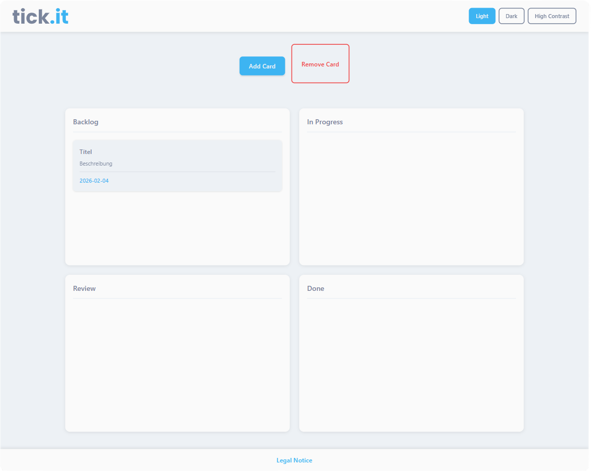

# [tick.it](https://phlipswis.github.io/tick-it/) - Webapp Kanban Board

tick.it is a web-based Kanban board application for managing tasks and workflows. The app allows users to create, edit, move, and delete tasks as cards.

## Use it [here](https://phlipswis.github.io/tick-it/) on GitHub Pages!

### Features:

- Create, edit, and delete cards via a modal
- Drag-and-drop to move cards between columns
- Delete cards via drag-and-drop
- Support for three themes:
    - Light
    - Dark
    - High Contrast
- Fully responsive design:
    - Mobile (≤ 1080px)
    - Tablet (1081px to 1919px)
    - Desktop (≥ 1920px)  
- Reduced motion implementation

### Technical Overview:

| Component           | Technology                           | Description                       |
|---------------------|--------------------------------------|-----------------------------------|
| **Frontend**        | HTML, CSS, TypeScript                | Vanilla JS, no frameworks         |
| **Data Storage**    | LocalStorage                         | `tickit-items` key in browser     |
| **State Handling**  | Synchronization between UI & LS      | Local arrays                       |

## AI Usage Documentation
- Assisted code generation with Claude Sonnet 4.5
- Debugging with Claude Sonnet 4.5